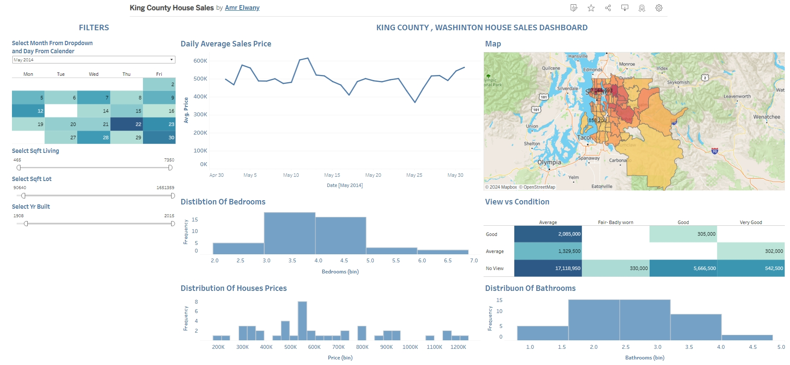

# Tableau Housing Data Dashboard

## Overview

This project transforms housing data into an interactive Tableau dashboard. It features:

- A price trend line chart
- Distribution histograms for prices, bedrooms, and bathrooms
- A view vs. condition heatmap
- Intuitive filters, including a calendar widget

The dashboard is designed to provide clear, actionable insights and is published online for easy access.

